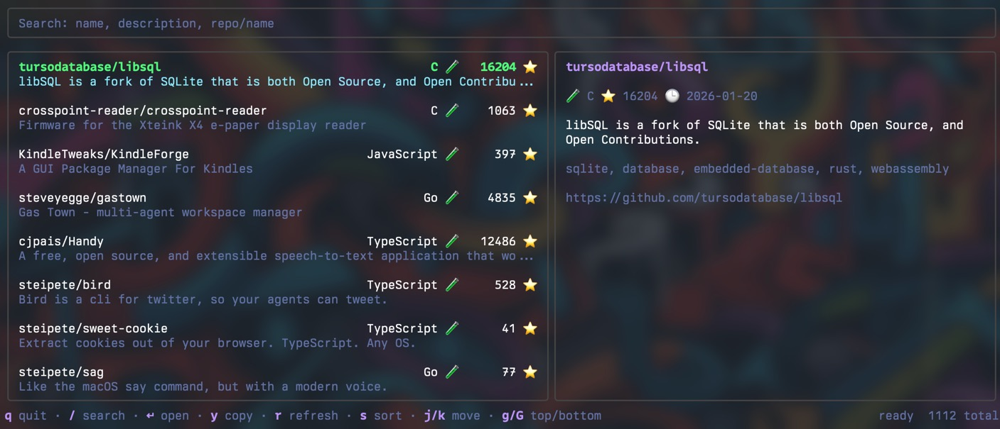

# gh-stars

A terminal UI to browse and search your GitHub stars.

<p align="center">
  
</p>

## Features

- Fast fuzzy search across names, descriptions, languages, and topics
- Preview panel with repo details (README coming soon)
- Smart caching with background sync
- Vim-style keyboard navigation
- Sort by stars, name, or recently updated

## Requirements

- GitHub CLI (`gh`) authenticated via `gh auth login`
- Go 1.22+

## Installation

```bash
go install github.com/viniciussoares/github-stars-tui/cmd/gh-stars@latest
```

Or build from source:

```bash
go build -o gh-stars ./cmd/gh-stars
./gh-stars
```

## Keybindings

| Key | Action |
|-----|--------|
| `j` / `k` / `↑` / `↓` | Navigate |
| `g` / `G` | Jump to top / bottom |
| `pgup` / `pgdown` | Page up / down |
| `/` | Focus search |
| `esc` / `enter` | Exit search |
| `s` | Cycle sort mode |
| `enter` | Open repo in browser |
| `y` | Copy repo URL |
| `r` | Force refresh |
| `q` | Quit |

## Cache

Stars are cached to `~/.config/gh-stars/cache.json` and refreshed in the background every 48h.

| Flag | Description |
|------|-------------|
| `-refresh` | Force refresh on startup |
| `-sync-interval` | Background refresh interval (default: 48h, 0 to disable) |
| `-cache ''` | Disable caching |

## Under the hood

gh-stars uses:

- [bubbletea](https://github.com/charmbracelet/bubbletea) for the TUI
- [lipgloss](https://github.com/charmbracelet/lipgloss) for styling
- [gh](https://github.com/cli/cli) for GitHub API access
